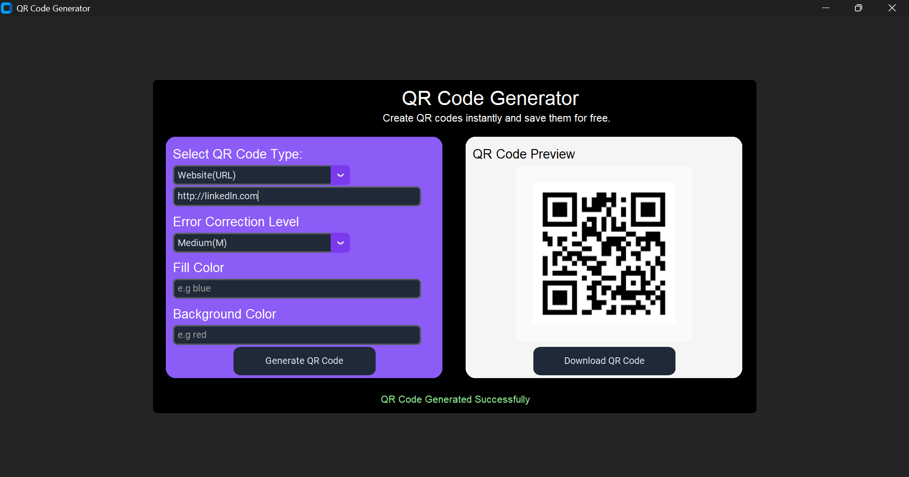

# QR_Code_Generator
A desktop application built with Python and CustomTkinter that allows users to generate and download customized QR codes for different types of data. The application supports websites, email addresses, phone numbers, SMS messages, Wi-Fi connections, Google Maps locations, and contact information. 

## Features

- Generate QR codes for websites (URLs)
- Generate QR codes for email addresses
- Generate QR codes for phone numbers
- Generate QR codes for SMS messages
- Generate QR codes for Wi-Fi connections
- Generate QR codes for Google Maps locations
- Generate QR codes for contact information (vCard)
- Custom fill and background colors
- Multiple error correction levels
- Real-time QR code preview
- Download generated QR codes as PNG images
- Input validation and error handling

## Technologies Used

- Python
- CustomTkinter
- QRCode Library
- Tkinter MessageBox
- Tkinter FileDialog

## Preview

## Author
 Odion Goodness Osadebah
